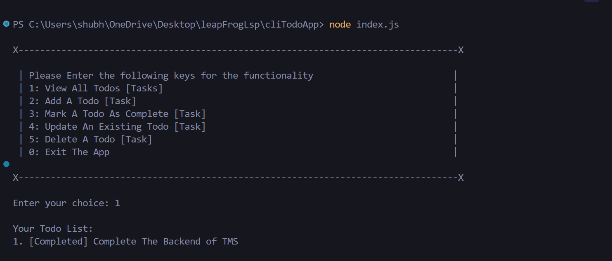
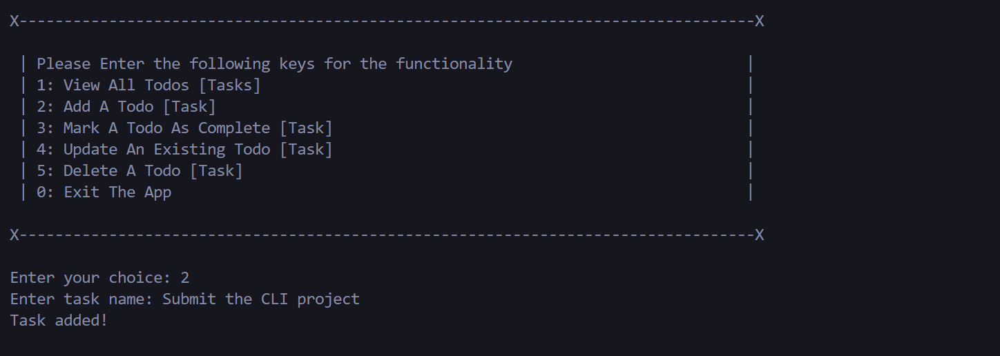
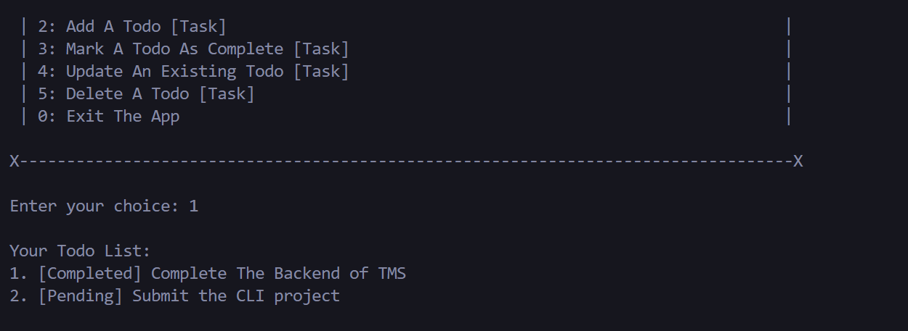
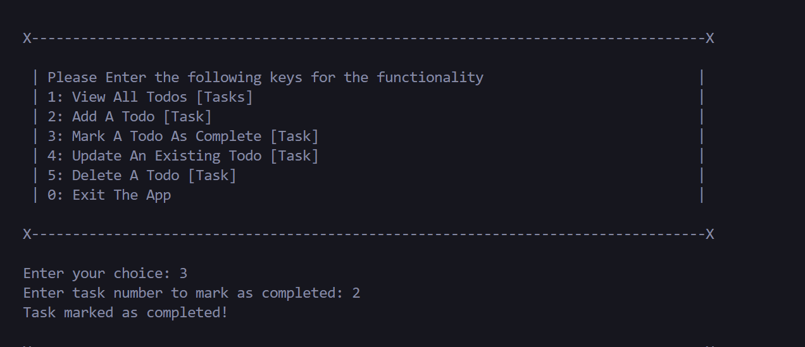
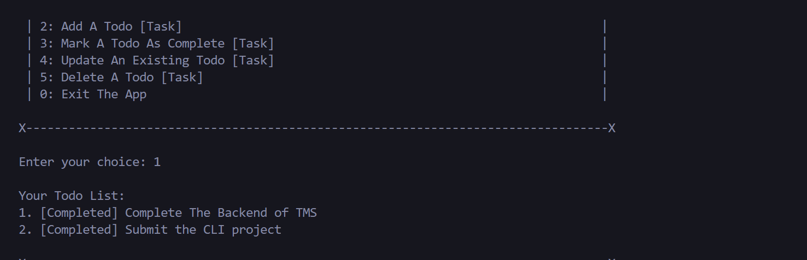
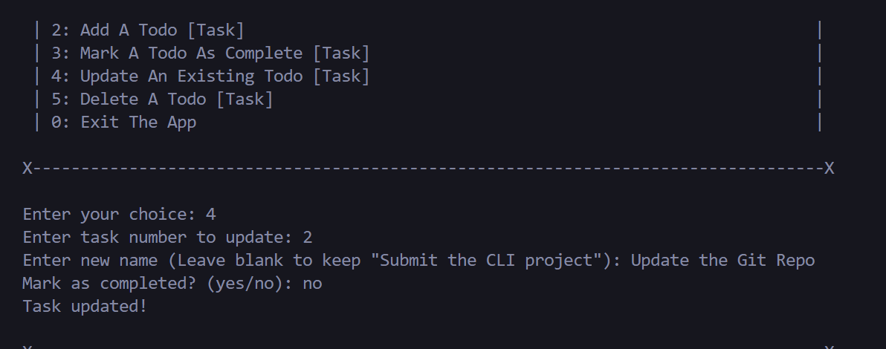
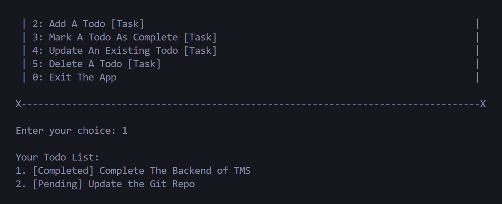
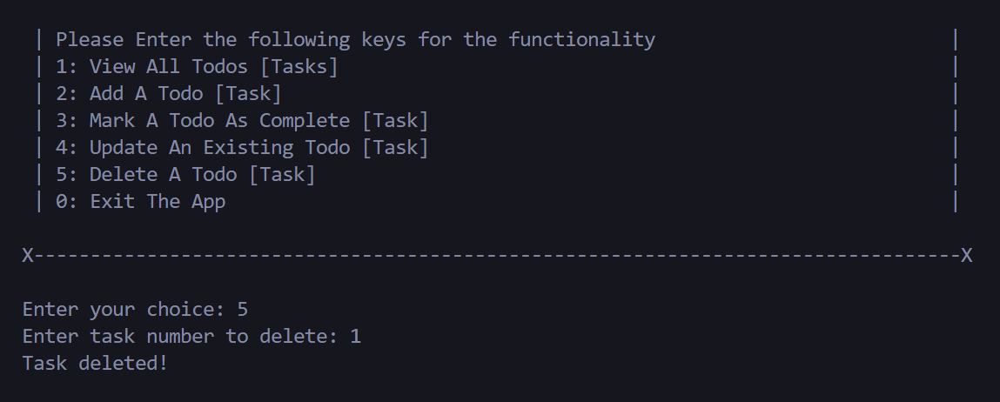
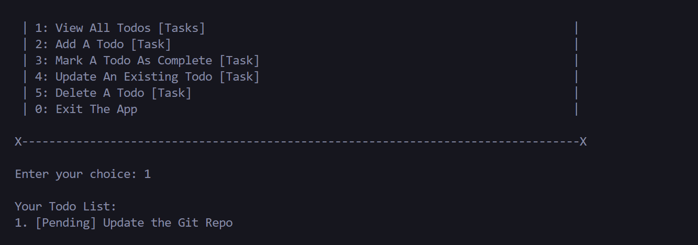
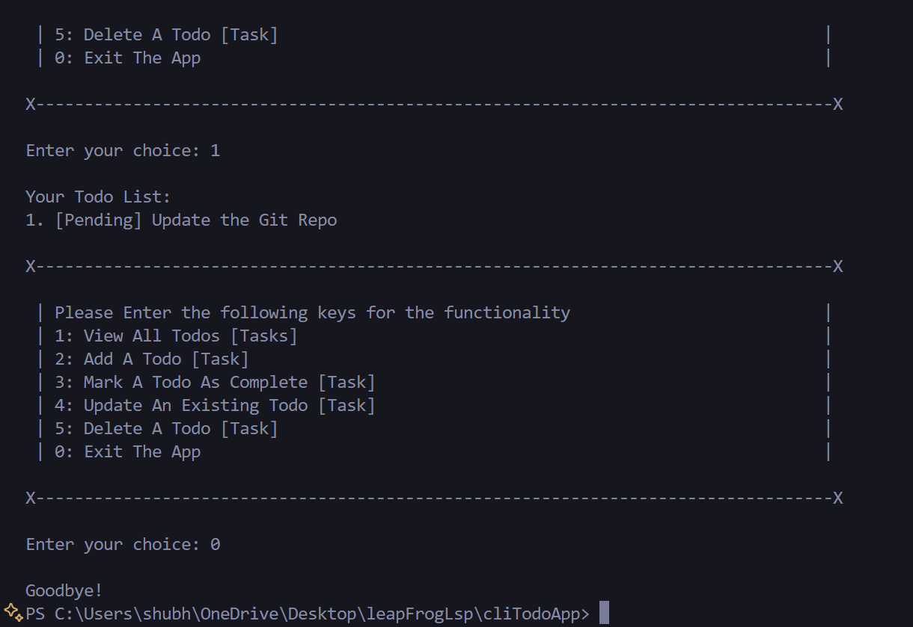

# CLI Todo App (Node.js)

A simple command-line interface (CLI) Todo application built using **Node.js** and **Clean Code Principles**.

This app allows users to manage tasks directly from the terminal — add, view, complete, update, and remove tasks, with data saved persistently in a JSON file.

---

## Features

- **Add Task** — Add a new todo task
- **List Tasks** — View all current tasks with completion status
- **Complete Task** — Mark a task as completed using its number
- **Update Task** — Edit an existing task's name or status
- **Remove Task** — Delete a task by its number
- **Data Persistence** — Tasks are saved in a local `todos.json` file

---

## Technologies Used

- [Node.js](https://nodejs.org/)
- Built-in `readline` and `fs` modules (no external libraries)

---

## Project Structure

cliTodoApp/
├── index.js # Main application file
├── todos.json # JSON file used to persist tasks
└── README.md # Project documentation

## Clean Code Principles Applied

- **Meaningful Names**: Variables and functions are clearly named (`saveTodos`, `askQuestion`, etc.).
- **Single Responsibility**: Each function does one clear task (e.g., saving, loading, asking questions).
- **Readable Structure**: Consistent indentation, logical switch-case handling.
- **Graceful Error Handling**: Invalid inputs are caught with user-friendly messages.
- **No Deep Nesting**: Clean, flat structures used throughout.
- **Lightweight Persistence**: Uses JSON file instead of a database for simplicity.

## How to Run

### Prerequisites

- [Node.js](https://nodejs.org/) installed

### Setup

1. Clone the repository
2. Navigate to the project folder
3. Run the app using:

```bash
node index.js
```

### Screenshots of the application











